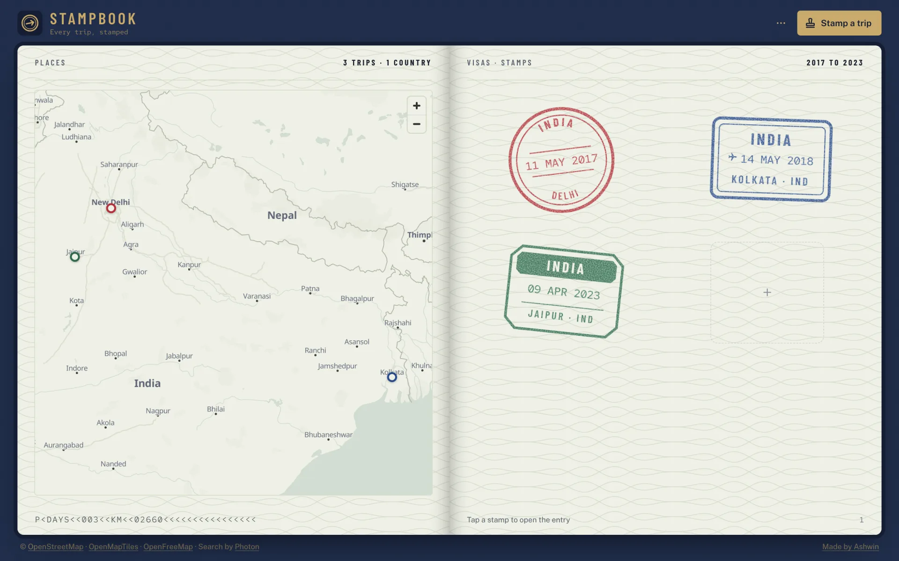
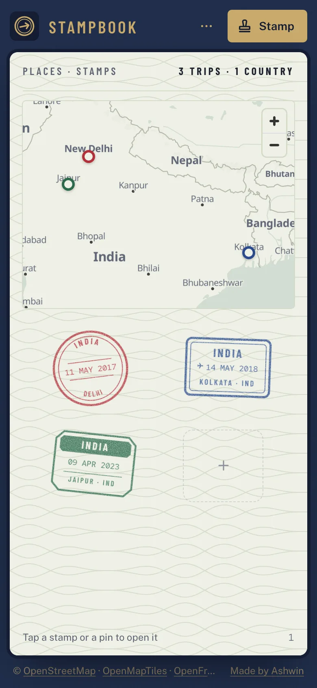
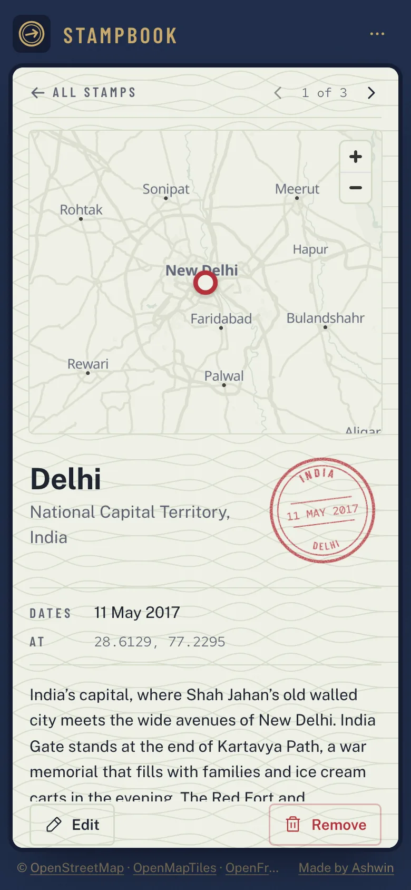
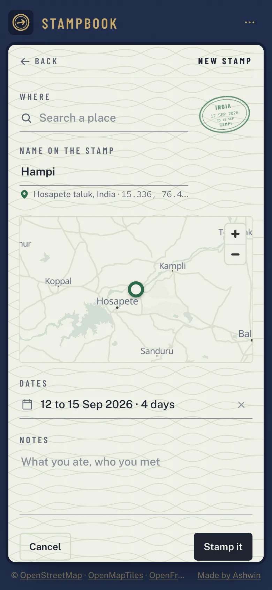
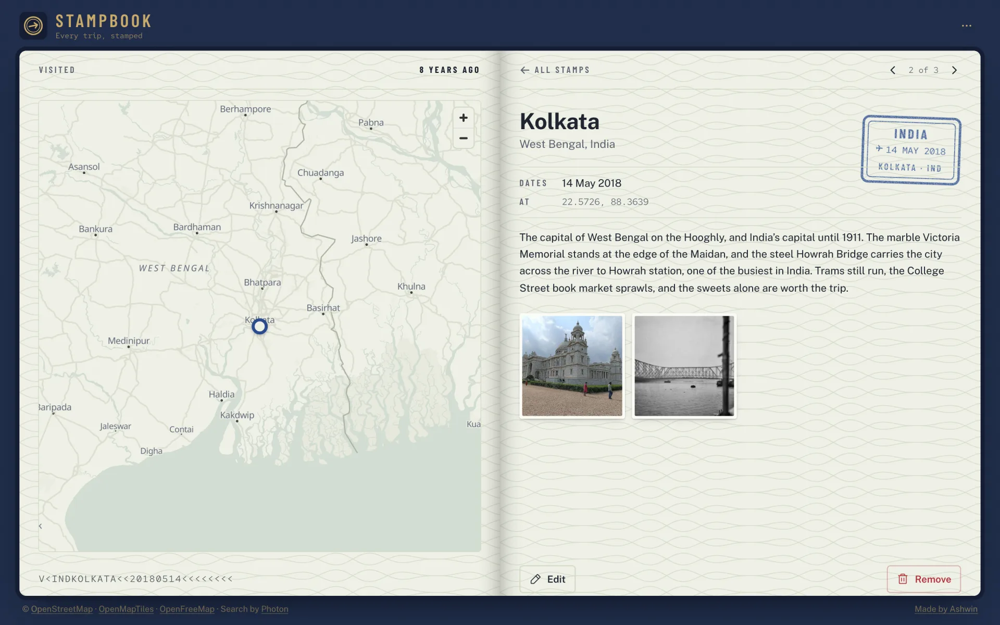
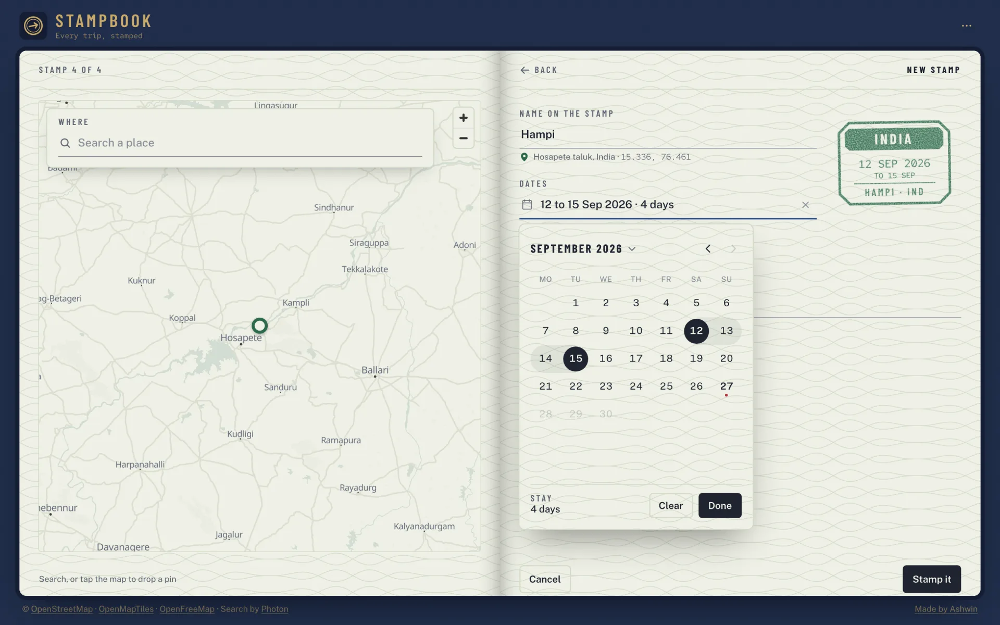
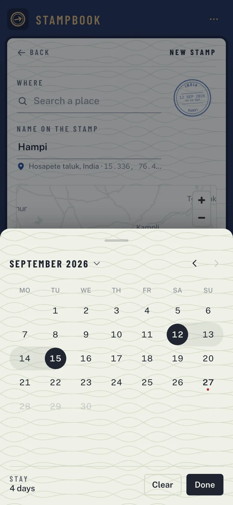
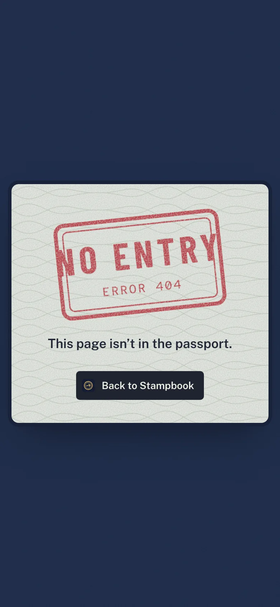

<p align="center">
  <a href="https://stampbook.ashwin.co.in">
    
  </a>
</p>

<p align="center">
  <a href="https://stampbook.ashwin.co.in"><strong>stampbook.ashwin.co.in</strong></a>
  &nbsp;·&nbsp;
  <a href="#what-it-does">what it does</a>
  &nbsp;·&nbsp;
  <a href="#the-design">the design</a>
  &nbsp;·&nbsp;
  <a href="#running-it">running it</a>
</p>

<br>

the source of **[stampbook.ashwin.co.in](https://stampbook.ashwin.co.in)**, a travel journal that works like a passport. every trip you log gets its own entry stamp, inked onto a visa page, with a map of everywhere you have been on the page beside it.

it used to be called travel journal and lived at travel.ashwin.co.in, with three trips written into the code. this is a full rebuild: new name, new design, and your own trips, kept on your device.

## what it does

<p align="center">
  
  &nbsp;
  
  &nbsp;
  
</p>

- **a stamp for every trip.** each trip is drawn as an entry stamp: round, oval, octagonal, a boxed arrival stamp, a notched one with a solid band, or a ring with the date knocked out of a bar. the shape, the ink and the tilt come from the trip, so no two pages look alike.
- **it thumps down.** save a trip and its stamp drops onto the page with a thud, a small jolt of the paper and a buzz on android phones.
- **search any place.** type a city, a landmark or an address and pick it from the list, or tap the map to drop a pin and let it work out where that is. drag the pin to move it.
- **name it your way.** the stamp takes the place name, and you can change it to whatever you called it.
- **the stamp fills in as you go.** the form shows the stamp live, so you see the country, the name and the dates land on it while you type.
- **photos.** add up to 24 a trip. they are resized on your device and open full screen with swipe and arrow keys.
- **a map of it all.** every trip is a pin in its stamp's ink. tap one to open the entry.
- **one map that flies.** there is only ever one map. it moves with you between pages: open an entry and it flies in to the place with its pin marked and the others faded, go back and it pulls out to fit every trip, start a new stamp and the search sits right on it. on phones it glides from the home page to the top of the entry instead of loading again.
- **india, drawn the way india draws it.** country borders come from natural earth's india point of view, so jammu and kashmir, ladakh (gilgit-baltistan and aksai chin included) and arunachal pradesh are shown whole, with no line of control.
- **pages that turn.** six stamps a page, oldest first, like a real passport. swipe, use the arrows, or the arrow keys.
- **the numbers, passport style.** the foot of the map page reads like a passport's machine readable line, with the days you have been away and the kilometres between your trips. each entry gets its own line too.
- **step through entries.** arrows beside the back link move to the previous or next stamp, and the map flies between them.
- **kept on your device.** trips live in indexeddb in your browser, photos included. nothing is uploaded.
- **backups.** save everything, photos too, as one file, and restore it on another device.
- **undo.** remove a stamp and you get a few seconds to take it back.
- **three stamps to start.** the passport opens with three of my own trips, delhi, kolkata and jaipur, so it is never blank. remove them and they stay gone.
- **sounds.** a page turn, a thud for a new stamp, a shutter for photos and small ticks for taps. made with the web audio api, quiet under the ios silent switch, and mute from the menu.
- **keys.** `n` for a new stamp, `←` `→` to turn pages, `esc` to close photos.
- **a 404 with no entry**, and every view sets its own page title.

## the design

the whole app is an open passport.

- **the cover.** the page around the book is the navy of an indian passport with a fine grain, and the name and the main button are gold foil, like the emblem and lettering on the cover.
- **the paper.** the pages are pale security paper with a guilloche pattern, the fine wavy lines printed on passports and banknotes, and a shadow down the fold.
- **two pages on wide screens, one on phones.** the map is the left page and the stamps the right. on phones and tablets the map sits at the top of the page with the stamps below it, and side by side on a short landscape phone.
- **the ink.** stamps are red, blue or green with a grainy, uneven impression, made from an svg noise filter so they look pressed rather than printed.
- **type.** barlow condensed for stamp lettering and page labels, public sans for everything you read, and red hat mono for dates and the passport line.
- **no dark mode.** passport pages are paper, so there is no toggle.
- **fits every screen.** from a 320 px phone to a 2560 px monitor, portrait or landscape, the page never scrolls sideways or down. the stamps grid measures its space and picks two columns, three, or one long row, whichever gives the biggest stamps.
- **nothing jumps.** fonts are self-hosted and preloaded with metric-matched fallbacks, and layout shift measures 0.
- **motion with a job.** the stamp you tap flies from the grid into its entry (and into the edit form), pages slide forward and back in the direction you are going, the passport never flashes on reload (it fades in once its fonts are ready), and reduced motion turns it all off.

## the stack

| layer | choices |
| --- | --- |
| ui | [react 19](https://react.dev) and [vite 8](https://vite.dev) |
| style | [tailwind css 4](https://tailwindcss.com) |
| motion | [motion](https://motion.dev) for the stamp, page turns, photos, the menu and toasts |
| map | [maplibre gl js](https://maplibre.org) with [openfreemap](https://openfreemap.org) tiles, recoloured to the paper, and [natural earth](https://www.naturalearthdata.com) borders |
| search | [photon](https://photon.komoot.io), built on openstreetmap data |
| storage | indexeddb |
| type | [barlow condensed](https://fonts.google.com/specimen/Barlow+Condensed), [public sans](https://public-sans.digital.gov) and [red hat mono](https://fonts.google.com/specimen/Red+Hat+Mono), self-hosted |
| icons | [phosphor](https://phosphoricons.com) |
| lint and format | [biome](https://biomejs.dev) |
| hosting | [vercel](https://vercel.com/) |

## running it

```sh
git clone https://github.com/Ashwin-S-Nambiar/Stampbook.git
cd Stampbook
npm install
npm run dev
```

then open http://localhost:5173. `npm run check` runs biome, and `npm run build` writes `dist/` with a matching `404.html`. no keys needed.

## the shape of it

```
src/
  App.jsx             layout, routes, the shared map and footer
  components/
    Home.jsx          the map page and the stamps page
    Stamps.jsx        the stamp grid, page turns and the thud
    Stamp.jsx         the six stamp shapes, drawn in svg
    Entry.jsx         one trip: stamp, dates, notes, photos, map
    Form.jsx          new and edit, with the live stamp
    PlaceSearch.jsx   photon search as you type
    MapView.jsx       the map, pins and dropping a pin
    MapSlot.jsx       where the one map sits on each page, and how it moves
    Photos.jsx        thumbnails and the full screen viewer
    Header.jsx        name, menu, backups and sound
    Book.jsx          the passport and its pages
    Left.jsx          what each view puts on the map page
    Toaster.jsx       toasts with undo
    NotFound.jsx      the 404
  lib/
    trips.js          trips store, save, remove and stats
    db.js             indexeddb
    photos.js         resizing and photo urls
    photon.js         search and reverse lookup
    map.js            loads maplibre and recolours the style
    stamp.js          shape, ink and tilt for a trip
    backup.js         save and restore
    seed.js           the three first stamps
    countries.js      country names and codes
    dates.js          dates on stamps and in entries
    route.js          urls for each view, and which way you are going
    stage.js          the shared map and its page slots
    sound.js          web audio
public/
  fonts/              barlow condensed, public sans and red hat mono
  samples/            photos for the first stamps
  borders.json        country borders, india's point of view
  paper.svg           the guilloche pattern
```

## known rough edges

- **one device at a time.** trips stay in the browser they were made in. a backup file is how you move them.
- **clearing site data clears the passport.** browsers can also evict storage when a device is low on space, so keep a backup.
- **search needs a connection**, and so does the map the first time you open an area.

<details>
<summary><strong>more screenshots</strong></summary>

<br>





<p align="center">
  
  &nbsp;
  
</p>

</details>

## credit

maps © [openstreetmap](https://www.openstreetmap.org/copyright) contributors, tiles by [openfreemap](https://openfreemap.org) and [openmaptiles](https://openmaptiles.org), search by [photon](https://photon.komoot.io) from komoot. country borders are from [natural earth](https://www.naturalearthdata.com), public domain. the photos for the first stamps are cc0, from wikimedia commons: [taj mahal 2018](https://commons.wikimedia.org/wiki/File:Taj_Mahal_2018.jpg), [india gate delhi](https://commons.wikimedia.org/wiki/File:INDIA_GATE_DELHI.jpg), [victoria memorial (2)](https://commons.wikimedia.org/wiki/File:Victoria_Memorial,_Kolkata,_West_Bengal_(2).jpg), [rabindra setu (howrah bridge)](https://commons.wikimedia.org/wiki/File:Rabindra_Setu_(Howrah_Bridge),_Kolkata.jpg), [amber fort in jaipur 2](https://commons.wikimedia.org/wiki/File:Amber_Fort_in_Jaipur_2.jpg) and [amber fort, jaipur 01](https://commons.wikimedia.org/wiki/File:Amber_fort_,_Jaipur_01.jpg).

---

[stampbook.ashwin.co.in](https://stampbook.ashwin.co.in) · [ashwin.co.in](https://ashwin.co.in) · [notes](https://notes.ashwin.co.in) · [x](https://x.com/ashwinnambiar11) · [github](https://github.com/Ashwin-S-Nambiar)
